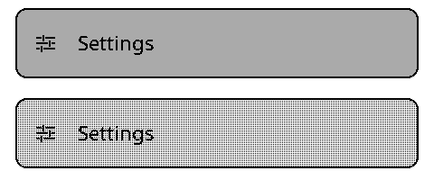

# Dithered UI refresh

UI gray is a screen-anchored 2 × 2 black-and-white pattern. The light-gray selection has 25% black coverage. The same conversion applies to shelf covers and settings thumbnails, so they do not force grayscale refresh during navigation.

Full-screen covers, image-viewer content and sleep images retain four genuine logical shades. The framebuffer remains 96,000 bytes. No waveform, voltage, phase timing, or image decoder changes are required. Inline EPUB illustrations now use the shared image renderer. Like other image content, they retain four shades in Reader and are dithered behind the interactive drawer.

## Device measurements

An authorized X4 trial on 2026-09-20 exercised this UI implementation before its port onto the current main branch and PNG test fixtures. The installed image was 591,600 bytes, SHA-256 `cbf21ee83d853fb790fb731c5e7685f1b39e2e94946f43f652d2e2dfaee5f989`. These measurements describe that artifact, not a subsequent main-based build.

| Operation | Refresh mode | Firmware duration |
| --- | --- | ---: |
| Previous solid-gray Home selection | Grayscale full clean | About 1,767 ms |
| Seventeen of eighteen dithered Home moves | Monochrome differential | 762–763 ms, median 763 ms |
| Home move sixteen | Periodic quick clean | 2,035 ms |
| Open an existing grayscale image | Grayscale full clean | 1,762 ms |
| Return from that image to Files | Monochrome full clean | 4,152 ms |
| Next file selection | Monochrome differential | 763 ms |

The existing policy cleans after fifteen differential updates. Leaving grayscale content resets and cleans the controller once before fast binary updates resume. There is no experimental three-attempt limit.

Guarded app1 write and byte-for-byte readback passed. Boot selection remained app1 with OTA sequence 2. Stock app0, other partitions, eFuses and OTP were not written. Recovery copies and raw device logs remain private.

Durations cover the firmware refresh routine, not button latency or camera-observed flicker. Logical captures retained intermediate image shades. No new optical flicker, ghosting, or physical sleep/wake measurement is claimed. Host and browser checks cover sleep-image preservation. The main-based PR build receives separate offline checks and has not been flashed.

## Native pixel comparison

The top row is the earlier solid-gray selection; the bottom row is the dithered selection. Both are unscaled 480 × 100 crops from the device framebuffer. Every pixel below the status header matched the original full frame after converting only its gray selection fill to the expected pattern. Text, icons and outlines were unchanged. The status header was excluded because the battery percentage changed.

These are logical pixels, not photographs of the panel.
