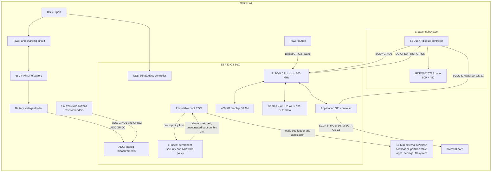
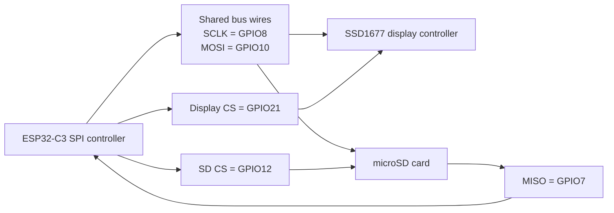

# Brewthink

The goal of this project is:

1. To learn more about Rust
2. To have some fun understanding a bit more about embedded development

I want to get more into reading, and what better way to do that than with fully open firmware on an Xteink X4?

## About the device

### Identity

| Property           | Value                                                                                         |
| ------------------ | --------------------------------------------------------------------------------------------- |
| Product            | Xteink X4 e-reader                                                                            |
| Board type         | Custom Xteink PCB, **not** an ESP32-C3 DevKit                                                 |
| SoC                | Espressif ESP32-C3, QFN32, revision v0.4                                                      |
| CPU                | 32-bit single-core RISC-V (`RV32IMC`), up to 160 MHz                                          |
| Crystal            | 40 MHz                                                                                        |
| On-chip SRAM       | 400 KB total; less is available to the application after the runtime and radio reserve memory |
| PSRAM              | None                                                                                          |
| Flash              | Puya 128-Mbit / 16 MiB SPI NOR, JEDEC `85 20 18` (consistent with PY25Q128HA); DIO at 80 MHz   |
| Wireless           | 2.4 GHz Wi-Fi 802.11 b/g/n and Bluetooth Low Energy 5                                         |
| USB                | ESP32-C3 native USB Serial/JTAG                                                               |
| Display            | 4.26-inch Good Display GDEQ0426T82 e-paper panel                                              |
| Display controller | Solomon Systech SSD1677                                                                       |
| Resolution         | 800 × 480, monochrome/grayscale-capable e-paper                                               |
| Storage            | microSD card over SPI                                                                         |
| Battery            | Approximately 650 mAh LiPo                                                                    |

The ESP32-C3 is the processor, while the X4 is a complete custom board around it. Selecting `esp32c3` configures the CPU, but a generic ESP32 project does not know the X4 pinout, display, partition table, buttons, battery circuit, or recovery behavior.

### Information observed from this physical X4

The serial device name can change after reconnecting it. On macOS, prefer the `/dev/cu.*` device for `espflash`:

```text
/dev/cu.usbmodem101  1001:303A  Espressif USB JTAG/serial debug unit
/dev/tty.usbmodem101 1001:303A  Espressif USB JTAG/serial debug unit
```

Commands used:

```bash
espflash list-ports
espflash board-info --chip esp32c3 --port /dev/cu.usbmodem101
nix shell nixpkgs#esptool -c esptool --chip esp32c3 --port /dev/cu.usbmodem3101 flash-id
```

Observed board information:

```text
Chip type: esp32c3 (revision v0.4)
Crystal frequency: 40 MHz
Flash size: 16MB
Features: WiFi, BLE
MAC address: <redacted; do not publish the device's unique MAC>

Security Information:
Flags: 0x00000000 (0)
Key Purposes: [0, 0, 0, 0, 0, 0, 12]
Chip ID: 5
API Version: 3
Secure Boot: Disabled
Flash Encryption: Disabled
SPI Boot Crypt Count (SPI_BOOT_CRYPT_CNT): 0x0
```

This unit is development-friendly:

- It enumerates over USB and the ROM download interface is accessible.
- Secure Boot is disabled, so the chip does not require signed application images.
- Flash Encryption is disabled, so a raw flash backup contains ordinary flash bytes and can be restored to this same device.
- Do not change or "burn" eFuses while learning.

A complete stock dump from this physical device has now been read successfully and verified as exactly 16,777,216 bytes. `espflash` completed its device/local MD5 validation before writing the file. The dump, checksum, and private binary extracts are kept under the repository's ignored `backup/` directory. Do not publish the dump, checksum, NVS, or filesystem contents.

A read-only JEDEC query of the physically fitted flash returned:

```text
Manufacturer: 0x85 (Puya Semiconductor)
Device:       0x2018
Capacity:     128 Mbit / 16 MiB
Full JEDEC:   85 20 18
```

This ID is consistent with the Puya **PY25Q128HA** family. JEDEC identification does not reveal the package/temperature suffix, so the exact ordering code cannot be asserted without reading the chip marking. The SFDP header at offset zero is `53 46 44 50` (ASCII `SFDP`), confirming that the chip exposes a valid JEDEC Serial Flash Discoverable Parameters table. The community schematic labels U2 as a Winbond `W25Q128JVSIQTR`, but this physical unit is fitted with a Puya-compatible part instead; firmware should depend on standard SPI NOR/SFDP behavior rather than assuming the schematic's vendor.

### Flash memory versus eFuses

The device has two different kinds of persistent configuration:

- **SPI flash** is rewritable storage containing the bootloader, partition table, applications, settings, and filesystem. It can be read, erased, backed up, and restored.
- **eFuses** are one-time-programmable bits inside the ESP32-C3. The immutable boot ROM reads them before loading anything from flash. They control permanent policy such as Secure Boot, Flash Encryption, USB download access, JTAG access, key purposes, calibration, and identity data.

A full flash backup does **not** contain the eFuses. eFuse bits generally only transition from unprogrammed to programmed and cannot be reverted. Never run commands such as `espefuse burn`, `burn_key`, or `burn_block_data` without a precise, reviewed reason.

The security information above is the important result for development: this X4 currently allows readable, unsigned, unencrypted firmware and USB recovery.

### Device component map

This diagram separates the components inside the ESP32-C3 from the components connected on the X4 PCB:



The 16 MiB firmware flash also uses an SPI-family hardware interface, but it is the processor's dedicated flash connection. It is not the shared application SPI bus used by the display and SD card. The extracted bootloader and stock application headers both specify **DIO at 80 MHz**, and the bootloader image marks the WP pin disabled. Their image checksums and validation hashes are valid. This supports the X4 design's reuse of the ESP32-C3's alternate `SPIHD`/`SPIWP` pins as board-specific GPIO12/GPIO13 functions while GPIO14–GPIO17 remain dedicated to the flash.

#### Shared SPI bus and chip-select lines



`CS` means **Chip Select**. It is a dedicated digital control wire that tells one peripheral whether the shared SPI traffic is intended for it. Chip select is normally **active low**:

| Display CS (GPIO21) | SD CS (GPIO12) | Result                                                      |
| ------------------- | -------------- | ----------------------------------------------------------- |
| High                | High           | Bus idle; neither device is selected                        |
| Low                 | High           | Display selected; SD must ignore the bus                    |
| High                | Low            | SD selected; display must ignore the bus                    |
| Low                 | Low            | Invalid/unsafe; both devices may interpret the same traffic |

Active-low signals are also written as `/CS`, `CS#`, or `nCS`. These names all mean that a low voltage asserts/selects the device.

SCLK and MOSI are physically connected to both devices, so both chips can see the same clock pulses and outgoing bits. A device with CS high should ignore them. When its CS goes low, it treats the subsequent bits as one of its own commands or data transfers.

Both devices must not be selected simultaneously because:

1. The SSD1677 and SD card use different command languages. The same byte sequence cannot safely be interpreted as both an e-paper command and an SD-card command.
2. SPI peripherals that share MISO normally drive that wire only while selected. If two selected devices drive opposite electrical levels, the read data is corrupted and the outputs electrically contend.
3. A transaction's speed, clock mode, byte framing, and expected response are chosen for one device. They may be invalid for the other device.

On this X4, the display is primarily write-only and the documented MISO line belongs to the SD card, reducing one source of electrical contention. Selecting both is still logically unsafe because both may consume clocks and MOSI bytes intended for the other.

A correct display transaction looks conceptually like this:

```text
1. Set SD CS high         (SD disabled)
2. Set display CS low     (display enabled)
3. Send one complete display command/data transaction
4. Set display CS high    (display disabled)
```

A correct SD transaction reverses the selected device:

```text
1. Set display CS high    (display disabled)
2. Set SD CS low          (SD enabled)
3. Send/read one complete SD transaction
4. Set SD CS high         (SD disabled)
```

In Rust, `embedded-hal` distinguishes the shared physical `SpiBus` from an `SpiDevice`, which represents one peripheral plus its CS behavior. Because Embassy tasks can run concurrently, the display and SD drivers also need a shared bus lock so their transactions cannot interleave.

### Hardware connections and GPIO map

#### Display (SSD1677 over SPI)

| Signal       | GPIO | Direction from ESP32 | Notes                                                       |
| ------------ | ---: | -------------------- | ----------------------------------------------------------- |
| SCLK         |    8 | Output               | Shared with microSD                                         |
| MOSI / DIN   |   10 | Output               | Shared with microSD                                         |
| Chip select  |   21 | Output               | Display-specific CS                                         |
| Data/command |    4 | Output               | Selects SSD1677 command or data bytes                       |
| Reset        |    5 | Output               | Hardware reset for display controller                       |
| Busy         |    6 | Input                | Display controller reports when an operation is in progress |

E-paper keeps its last image without power. A stale screen does not prove that the CPU is still running, and a reset does not necessarily clear the display.

#### microSD card (shared SPI bus)

| Signal    | GPIO | Direction from ESP32 | Notes               |
| --------- | ---: | -------------------- | ------------------- |
| CS        |   12 | Output               | SD-specific CS      |
| MISO / DO |    7 | Input                | Data from SD card   |
| MOSI / DI |   10 | Output               | Shared with display |
| SCLK      |    8 | Output               | Shared with display |

The display and SD card share SCLK and MOSI. Their chip-select lines must be managed so only one device is active at a time. In Rust, access to the shared SPI bus should be serialized rather than letting independent tasks use it concurrently.

#### Buttons, battery, and USB detection

| Function                |    GPIO | Type             | Notes                                                                                                   |
| ----------------------- | ------: | ---------------- | ------------------------------------------------------------------------------------------------------- |
| Battery voltage         |       0 | ADC input        | Battery is measured through a 2 × 10 kΩ divider, so the ADC sees approximately half the battery voltage |
| Back/Confirm/Left/Right |       1 | ADC input        | Four-button resistor ladder                                                                             |
| Up/Down                 |       2 | ADC input        | Two-button resistor ladder                                                                              |
| Power button            |       3 | Digital input    | Active low; can be used as a deep-sleep wake source                                                     |
| USB/charging detection  |      20 | Input / UART0 RX | Community firmware samples use this to detect USB connection                                            |
| Native USB D− / D+      | 18 / 19 | USB              | Keep available if native USB Serial/JTAG is required                                                    |

Approximate raw 12-bit ADC values reported by the community sample:

| Button  | Approximate raw value |
| ------- | --------------------: |
| Back    |                  3470 |
| Confirm |                  2655 |
| Left    |                  1470 |
| Right   |                     3 |
| Up      |                  2205 |
| Down    |                     3 |

These values are calibration starting points, not universal constants. Firmware should use ranges, debouncing, and measurements from this physical unit.

### Verified stock X4 partition layout

The following table was decoded from the partition-table sector at `0x8000` in this physical device's complete stock dump. Its stored partition-table MD5 exactly matches the calculated MD5. It also matches the previously documented community layout, so these values are now verified rather than provisional.

| Region              | Type/subtype     |     Offset |            Size | Address range       |
| ------------------- | ---------------- | ---------: | --------------: | ------------------- |
| Bootloader/reserved | Boot metadata    | `0x000000` |  Up to `0x8000` | `0x000000–0x007FFF` |
| Partition table     | ESP-IDF table    | `0x008000` | `0x1000` sector | `0x008000–0x008FFF` |
| `nvs`               | Data / NVS       | `0x009000` |      `0x005000` | `0x009000–0x00DFFF` |
| `otadata`           | Data / OTA       | `0x00E000` |      `0x002000` | `0x00E000–0x00FFFF` |
| `app0`              | App / OTA slot 0 | `0x010000` |      `0x640000` | `0x010000–0x64FFFF` |
| `app1`              | App / OTA slot 1 | `0x650000` |      `0x640000` | `0x650000–0xC8FFFF` |
| `spiffs`            | Data / SPIFFS subtype | `0xC90000` |   `0x360000` | `0xC90000–0xFEFFFF` |
| `coredump`          | Data / core dump | `0xFF0000` |      `0x010000` | `0xFF0000–0xFFFFFF` |

Verified stock contents:

- `app0` contains the valid stock ESP32-C3 application and is selected by valid OTA sequence `1`.
- `app1` is completely erased (`0xFF`) and contains no application image.
- The stock `app0` image uses DIO at 80 MHz, has valid image checksums/hashes, and reports ESP-IDF `v4.4.7-dirty` with project name `arduino-lib-builder`.
- The filesystem partition is named and typed `spiffs` in the partition table, but its on-flash metadata identifies **LittleFS**. Treat the partition-table subtype as a label/compatibility value, not proof that the stored format is SPIFFS.
- NVS contains data and must remain private because it can hold settings, credentials, calibration, and unique values.
- The coredump partition is erased; no crash dump was present in this backup.

`otadata` tells the bootloader which OTA application slot to boot. The two application slots allow a new image to be placed in one slot while retaining another image as a recovery option. An application must fit inside its slot (`0x640000` bytes in this layout).

#### OTA boot selection (`otadata`)

The `otadata` partition is a small boot-selection metadata area:

```text
otadata offset: 0x00E000
otadata size:   0x002000 = 8192 bytes
sector 0:       0x00E000..0x00EFFF
sector 1:       0x00F000..0x00FFFF
```

Each 4 KiB sector can hold one ESP-IDF OTA select entry near the start of the sector. The useful entry is 32 bytes; the rest of the sector is normally erased-looking `0xFF` padding.

Simplified entry layout:

```text
+0x0000..+0x0003  ota_seq, little-endian u32
+0x0004..+0x001B  unused/reserved bytes; observed as 0xFF on this X4
+0x001C..+0x001F  CRC32 of ota_seq, little-endian u32
+0x0020..+0x0FFF  erased/padding bytes, 0xFF
```

The bootloader reads the partition table, finds the OTA app slots, reads both `otadata` sectors, ignores invalid/corrupt entries, and chooses the highest valid OTA sequence number. With two OTA app partitions, the sequence maps to slots like this:

| OTA sequence | Selected slot |
| -----------: | ------------- |
| `1`          | `app0`        |
| `2`          | `app1`        |
| `3`          | `app0`        |
| `4`          | `app1`        |

This physical unit's stock `otadata` backup decoded as:

```text
sector 0: valid seq=1 -> app0
sector 1: empty/unselected
```

Therefore the bootloader currently selects stock `app0`.

To test Brewthink in `app1` after writing and verifying an app image there, write a valid `seq=2` OTA select sector at `0x00F000` only. For this bootloader format, the first 32 bytes of the sector are:

```text
02 00 00 00  ff ff ff ff  ff ff ff ff  ff ff ff ff
ff ff ff ff  ff ff ff ff  ff ff ff ff  74 37 f6 55
```

That is `ota_seq = 2` plus CRC `0x55F63774`, followed by `0xFF` padding to fill the 4 KiB sector. After that write, the bootloader sees `seq=1` in sector 0 and `seq=2` in sector 1, picks the higher valid sequence, and boots `app1` at `0x650000`.

Always back up `otadata` before changing it. The original state can be restored by writing the backed-up 8 KiB `otadata` file back to `0x00E000`. A normal OTA updater can also switch back to `app0` by writing a newer valid odd sequence such as `seq=3`.

Do not assume a generic `esp-generate` project uses this table. A normal `cargo run` may generate or flash a different bootloader/partition arrangement.

### Back up this X4 before writing firmware

The backup is a byte-for-byte copy of the complete external flash, from address `0x00000000` through `0x00FFFFFF`. It includes the bootloader, partition table, NVS, OTA state, both application slots, filesystem, and core-dump partition.

Keep the raw backup **out of Git**. It may remain under the repository's `backup/` directory because the repository-local `.gitignore` excludes that entire directory. It can contain stock copyrighted firmware, Wi-Fi credentials, settings, reading history, and unique device information. Store at least one additional private copy elsewhere; commit only the procedure, decoded partition CSV, and redacted metadata outside `backup/`.

```bash
BACKUP_DIR="$HOME/X4-backups/stock-$(date +%Y-%m-%d)"
mkdir -p "$BACKUP_DIR"
cd "$BACKUP_DIR"

PORT="/dev/cu.usbmodem101"

espflash board-info \
  --chip esp32c3 \
  --port "$PORT" \
  2>&1 | tee board-info.txt

espflash read-flash \
  --chip esp32c3 \
  --port "$PORT" \
  0x0 \
  0x1000000 \
  x4-stock-full-16MiB.bin
```

Command meanings:

- `0x0` is the first flash address.
- `0x1000000` is 16 MiB, or 16,777,216 bytes.
- `read-flash` is read-only with respect to flash, although it resets the processor to communicate with the ROM bootloader.

Verify the exact size and create an integrity fingerprint:

```bash
stat -f '%z' x4-stock-full-16MiB.bin
# Must print: 16777216

shasum -a 256 x4-stock-full-16MiB.bin \
  | tee x4-stock-full-16MiB.bin.sha256

shasum -a 256 -c x4-stock-full-16MiB.bin.sha256
# Must print: x4-stock-full-16MiB.bin: OK
```

If a large read fails, stop and inspect the error. A slower fallback is the same command with `--no-stub`; never respond to a read failure by erasing or writing the device.

A full-backup restore command, for recovery only and only to this same device, would be:

```bash
espflash write-bin \
  --chip esp32c3 \
  --port "$PORT" \
  0x0 \
  x4-stock-full-16MiB.bin
```

Do not run the restore command merely to test the backup.

### Discover the actual stock partition table

The standard ESP-IDF partition-table offset is `0x8000`. After creating the full backup, extract its 4 KiB partition-table sector locally:

```bash
dd \
  if=x4-stock-full-16MiB.bin \
  of=x4-stock-partition-table.bin \
  bs=1 \
  skip=$((0x8000)) \
  count=$((0x1000))
```

This reads only the local backup file; it does not communicate with the X4.

Decode it to a human-readable CSV:

```bash
espflash partition-table \
  --to-csv \
  --output x4-stock-partition-table.csv \
  x4-stock-partition-table.bin

cat x4-stock-partition-table.csv
```

The decoded CSV from this physical device is authoritative. It matches the community layout recorded above. The 4 KiB binary sector and decoded CSV contain partition metadata rather than NVS/filesystem content and can be retained as project documentation.

### Useful tools

| Tool                       | Purpose                                                                                                                |
| -------------------------- | ---------------------------------------------------------------------------------------------------------------------- |
| `esp-generate`             | Generates a generic ESP32 Rust application skeleton; it is not an X4 board-support package                             |
| `espflash list-ports`      | Lists serial devices                                                                                                   |
| `espflash board-info`      | Reads chip, flash, and security information                                                                            |
| `espflash read-flash`      | Reads a flash region into a local file                                                                                 |
| `espflash checksum-md5`    | Computes the device-side checksum of a flash region                                                                    |
| `espflash partition-table` | Prints or converts ESP-IDF partition tables                                                                            |
| `esptool flash-id`         | Read-only query for the external SPI NOR manufacturer/device JEDEC ID                                                   |
| `esptool image-info`       | Inspects a local ESP bootloader/application image header and validates its checksum/hash                                |
| `espflash flash`           | Converts/flashes an ELF application and may involve bootloader/partition choices; use only with an understood X4 build |
| `espflash write-bin`       | Writes a raw binary at an exact flash offset; inherently destructive                                                   |
| `espefuse summary`         | Reads permanent chip configuration; commands containing `burn` are irreversible                                        |
| `probe-rs`                 | JTAG flashing and interactive debugging; separate from the serial bootloader workflow                                  |

### Sources

- [Xteink X4 sample firmware](https://github.com/CidVonHighwind/xteink-x4-sample)
- [Open X4 sample firmware](https://github.com/open-x4-epaper/sample-firmware)
- [Xteink X4 schematics](https://github.com/sunwoods/Xteink-X4)
- [Good Display GDEQ0426T82 product page](https://www.good-display.com/product/457.html)
- [ESP32-C3 datasheet](https://www.espressif.com/sites/default/files/documentation/esp32-c3_datasheet_en.pdf)
- [ESP-IDF partition-table documentation](https://docs.espressif.com/projects/esp-idf/en/latest/esp32/api-guides/partition-tables.html)
- [Puya PY25Q128HA datasheet](https://www.puyasemi.com/download_path/%E6%95%B0%E6%8D%AE%E6%89%8B%E5%86%8C/Flash%20%E8%8A%AF%E7%89%87/PY25Q128HA_Datasheet_V2.3.pdf)
- [Rust on ESP Book](https://docs.espressif.com/projects/rust/book/)

## Some learnings

SPI = Serial Peripheral Interface
which is a method to allow a processor to comunicate with other chips by sending literal bits through a wire.
main problem this solves is that basically instead of having a connection for each pin from one controller to another periphal, we use only one pin for one controller to use multiple peripherals.

- SPI controller: hardware inside the ESP32-C3 that generates SPI signals.
- SPI bus: physical copper traces connecting chips.
- SPI device: a chip attached to that bus.
- SPI driver: software that controls the controller or understands a device’s commands.
