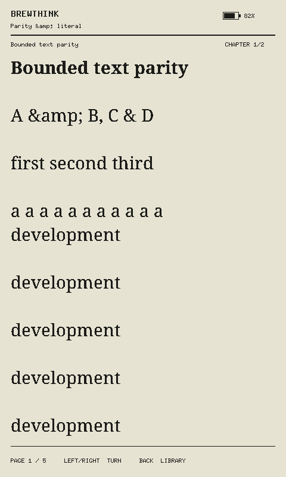
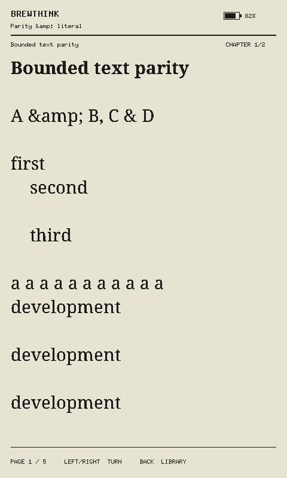

# Simulator reading parity

Imported EPUBs now use `DeviceEpub`, `StreamingZip`, bounded XML/layout, and the device PNG/JPEG cover decoders. The browser no longer uses the host inspection parser or its separate paginator. Those host inspection tools remain available.

`simulator::Book` owns the imported chapter XHTML. Each resource obeys the device's 140 KiB limit and the publication's 64-item spine limit. `Chapter::page` produces only the requested bounded page. Typography changes recompute page counts through the same layout function used by the device.

The simulator checks both compressed and uncompressed cover sizes against the 128 KiB cover budget. Missing, oversized, unsupported, and failed covers remain distinct in `Cover`; the UI uses a placeholder or the existing sleep fallback. PNG and JPEG rendering use the device's scale, luma, dithering, and alpha behavior. Unselected shelf covers use the device's shared two-by-two downsampling rule.

The canned demo still uses synthetic chapter text and procedural images. Its text enters bounded XHTML layout, but it does not claim to exercise archive parsing. Imported files exercise the complete reading path.

## What the tests prove

Run from the development shell after installing the web dependencies and Chromium:

```sh
bash scripts/check-simulator-parity.sh
```

The script generates synthetic EPUBs and runs `simulator-oracle` without the `web-sim` feature. That native tool reads them through the device APIs and renders reference frames with the shared `App` and renderer. Playwright imports the same files into the production WASM build and compares all 48,000 packed framebuffer bytes.

The cases cover ten reader frames across two typography configurations and two chapters, sleep/wake restoration, PNG and JPEG cover sleep frames, malformed XML, oversized resources, too many spine items, and cover fallbacks. Host tests also compare all 27 font/size/spacing combinations. A separate unit test checks all sixteen possible two-by-two shelf-cover pixel patterns.

The original browser fails the pixel comparisons and the device-budget checks. The captured example below shows its collapsed preformatted block. The corrected browser preserves the newlines and indentation. Literal `&amp;` spelling in this fixture is intentional CDATA content.

| Original browser | Bounded browser |
| --- | --- |
|  |  |

## Limits

This is reading-path parity, not ESP32 emulation. The browser keeps all bounded chapter sources in host memory and checks them during import. The device reads chapters from SD on demand. Browser tests do not reproduce SD faults, SRAM pressure, USB timing, display waveforms, or physical power loss.

The simulator parity workflow is separate from the general browser workflow. It owns a strict-port production preview and does not reuse a development server. Set `BREWTHINK_PARITY_PORT` when its default port 4185 is occupied.
