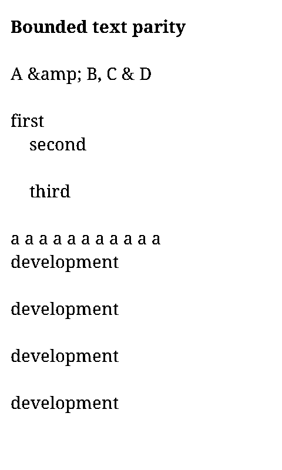
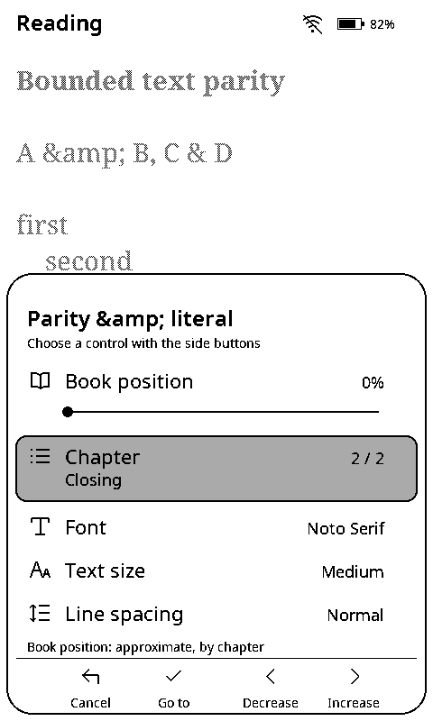

# Simulator reading parity

Imported EPUBs use `DeviceEpub`, `StreamingZip`, bounded XML/layout, and the native PNG/JPEG decoders. The browser no longer has its own imported-book parser, paginator, or image decoder. Host inspection and image-conversion tools remain available separately.

`simulator::Book` owns chapter XHTML bounded to 140 KiB per resource and 64 spine items. `Chapter::page` produces the requested bounded page and its page count. Typography changes use the device layout function. EPUB 3 navigation and EPUB 2 NCX supply chapter names; missing names fall back to `Chapter n`. Malformed navigation clears partial names, records its typed error, and emits a browser console warning without rejecting readable text. Canned books retain their explicit `Section n` labels.

## Covers and UI

Both compressed and uncompressed cover entries must fit 128 KiB. Shelf decoding produces a 176 × 264 image. Other shelf slots use the device's shared two-by-two luma average to reduce that image to 88 × 132.

Original-resolution opening and sleep frames have a separate **96 KiB encoded-input limit**. This is 98,304 input bytes, distinct from the **96,000-byte** packed output. Those frames decode the original PNG/JPEG directly at 480 × 800 with Contain scaling, not an enlarged shelf thumbnail. A cover between the limits can appear on the shelf while opening skips to text and sleep uses its fallback.

`Cover` distinguishes missing, oversized, unsupported, failed, and decoded sources. A decoded shelf carries a separate `OriginalFrame` outcome: decoded, too large, or failed. Eligible shelf and full-frame pixels are decoded once at import, keeping rendering immutable. PNG/JPEG source-error tests cover both targets; current decoder failures depend on the source, not the destination geometry.

The shared Noto chrome, light-grey selections with black text/outlines, drawer drafts, row-specific Confirm behavior, Back cancellation, and original cover views remain intact. Logical pixels are exactly 0, 85, 170, and 255. Warm browser chrome does not tint native frames.

## Verification

From the development shell, after installing web dependencies and Chromium:

```sh
bash scripts/check-simulator-parity.sh
```

The script regenerates 17 deterministic synthetic EPUBs and compares them byte-for-byte with the committed fixtures. `simulator-oracle` runs without `web-sim`: it reads through the device APIs, applies each cover budget independently, and renders references with `App` and the native renderer. It never calls `simulator::Book` or `Cover`. Playwright imports the same inputs into the production WASM build and compares all 96,000 framebuffer bytes across both bitplanes.

Coverage includes:

- Ten reader pages across two typography configurations and two chapters; host tests cover all 27 font/size/spacing combinations.
- Native drawer frames for staged chapter changes, cancellation, applied jumps, 0%/100% endpoints, staged/applied typography, and sleep/wake restoration.
- Named EPUB 3/NCX navigation and missing/malformed navigation fallback.
- PNG/JPEG opening and sleep frames, plus the existing full-resolution cover fixture that detects thumbnail enlargement.
- Exact 96 KiB, 96 KiB + 1, 128 KiB, and 128 KiB + 1 inputs; a valid DEFLATE entry whose compressed size alone exceeds the shelf limit.
- Native CLI and browser rejection of malformed XML, oversized chapters, and too many spine items; readable books with missing, oversized, unsupported, or corrupt covers.
- Every one of the 256 four-shade, two-by-two shelf pixel patterns, including rounding ties.

These native browser captures match the oracle byte-for-byte. Literal `&amp;` in the fixture is intentional CDATA content.

| Bounded reader | Staged named chapter |
| --- | --- |
|  |  |

The separate parity workflow owns a strict-port production preview, never a reused development server. `BREWTHINK_PARITY_PORT` overrides port 4185. Production, development-reload, and parity configurations share port validation and strict TypeScript checks. Main CI runs are not cancelled by later pushes.

## Limits

This is reading-path parity, not ESP32 emulation. The browser retains all bounded chapter sources and checks them at import; the device reads chapters from SD on demand. A malformed later chapter can therefore fail earlier in the browser. The canned demo exercises bounded layout and procedural images, not archive parsing.

These checks do not reproduce SD faults, device SRAM pressure, USB timing, display waveforms, optical shades, refresh latency, or physical power loss. No hardware operations are part of this workflow. The known source-pixel shrinking defect is shared by both callers and is not fixed by parity.
